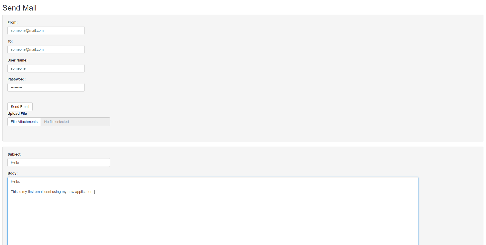

# sendmail
+ This application is an app that can send email via the mailR package. This allows a user to send emails and only requires their **user name** and **password** for their general email account. 

